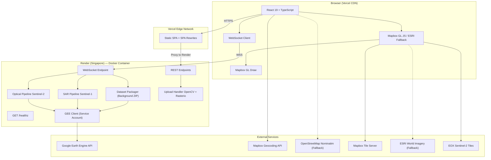
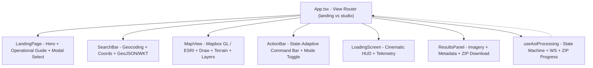
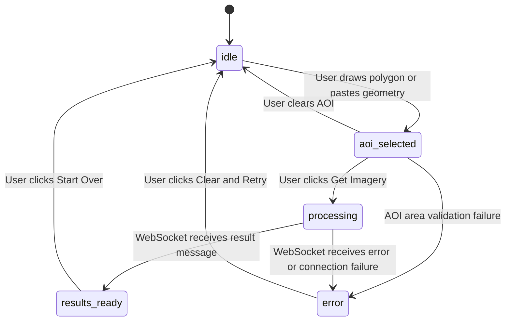

# SatQuery AI — Architecture Document

> **Last Updated:** 2026-10-07
> **Iteration:** v0.2.0 — Cloud-Native Dual-Mode Architecture
> **Maintainers & Agents:** Always automatically update this document and `GEMINI.md` whenever new features, endpoints, pipeline changes, or configurations are introduced to preserve accurate project context.

---

## Table of Contents

1. [Project Overview](#1-project-overview)
2. [High-Level Architecture](#2-high-level-architecture)
3. [Deployment Architecture](#3-deployment-architecture)
4. [Repository Structure](#4-repository-structure)
5. [Backend — FastAPI + Google Earth Engine](#5-backend--fastapi--google-earth-engine)
6. [Frontend — React + TypeScript + Vite](#6-frontend--react--typescript--vite)
7. [Frontend ↔ Backend Integration](#7-frontend--backend-integration)
8. [Environment and Configuration](#8-environment-and-configuration)
9. [Build and Development Toolchain](#9-build-and-development-toolchain)
10. [Launcher Scripts](#10-launcher-scripts)
11. [Key Design Decisions](#11-key-design-decisions)
12. [Known Limitations and Future Work](#12-known-limitations-and-future-work)
13. [Changelog](#13-changelog)

---

## 1. Project Overview

**SatQuery AI** is a full-stack, cloud-deployed web application for interactive satellite imagery retrieval and time-series dataset generation. Users draw an Area of Interest (AOI) on an interactive map, select a retrieval mode, and the system retrieves **Sentinel-2 optical RGB** and **Sentinel-1 SAR backscatter** imagery from Google Earth Engine (GEE).

### Key Capabilities

- **Cloud-Free Composite Mode:** Produces a statistically clean median composite from the best available scenes.
- **Multi-Scene Time-Series Mode:** Harvests up to 20 individual timestamped scenes, packaging them into a downloadable ZIP archive with ISO-8601 filenames — ready for temporal analysis, change detection, and remote sensing ML models.
- **Background Dataset Packaging:** Immediate preview delivery to the UI while GeoTIFF scenes are harvested and packaged into a ZIP archive in the background, streamed as real-time progress over WebSocket.

### Core User Flow

```
User draws polygon on map
    -> Frontend validates area (1-250 km²)
    -> POST /api/aoi with GeoJSON geometry, dates, mode, max_scenes
    -> Backend returns job_id
    -> Frontend opens WebSocket /ws/process/{job_id}
    -> Backend runs Optical pipeline -> SAR pipeline (chained)
    -> Real-time status messages streamed to frontend
    -> Immediate preview result: thumbnail URLs + download URLs
    -> Background: individual GeoTIFF scenes harvested + packaged into ZIP
    -> ZIP progress streamed over same WebSocket
    -> Frontend displays imagery in results panel + dataset download button
```

---

## 2. High-Level Architecture



---

## 3. Deployment Architecture

### 3.1 Split-Deployment Model

| Component | Host | Region | URL Pattern |
|---|---|---|---|
| **Frontend** | Vercel (Free Tier) | Global Edge CDN | `https://<project>.vercel.app` |
| **Backend** | Render (Free Tier) | Singapore (`sin1`) | `https://<service>.onrender.com` |

### 3.2 Frontend (Vercel)

- **Build Command:** `cd frontend && npm install && npm run build`
- **Output Directory:** `frontend/dist`
- **SPA Routing:** `vercel.json` with `rewrites: [{ source: "/(.*)", destination: "/index.html" }]`
- **Auto-Deploy:** GitHub integration — pushes to `main` trigger automatic builds.
- **Environment Variables (Vercel Dashboard):**
  - `VITE_MAPBOX_TOKEN` — Mapbox public access token
  - `VITE_API_BASE_URL` — Render backend URL (e.g., `https://satquery-backend.onrender.com`)
  - `VITE_WS_BASE_URL` — Render WebSocket URL (e.g., `wss://satquery-backend.onrender.com`)

### 3.3 Backend (Render)

- **Runtime:** Docker (Python 3.11-slim)
- **Build:** Dockerfile in `set-query-ai/backend/`
- **Root Directory:** `set-query-ai/backend`
- **Start Command:** `uvicorn app.main:app --host 0.0.0.0 --port ${PORT:-7860}`
- **Auto-Deploy:** GitHub integration — pushes to `main` trigger automatic builds.
- **Environment Variables (Render Dashboard):**
  - `GEE_SERVICE_ACCOUNT_JSON` — Full JSON content of the GEE service account key (injected at runtime; written to disk by `gee_client.py`)
  - `GEE_PROJECT` — Google Cloud project ID (`krishi-dhristi`)
  - `FRONTEND_ORIGIN` — Comma-separated allowed origins (e.g., `https://satquery.vercel.app,https://*.vercel.app`)
- **Healthcheck:** `GET /healthz` returns `{"status": "ok", "service": "SatQuery AI", "version": "0.2.0"}`

### 3.4 Google Cloud IAM Requirements

The GEE service account (e.g., `satquery-backend@krishi-dhristi.iam.gserviceaccount.com`) requires the following roles on the GEE project (`krishi-dhristi`):

| Role | Purpose |
|---|---|
| `roles/serviceusage.serviceUsageConsumer` | Permission to call GEE APIs |
| `Earth Engine Resource User` | Permission to create thumbnails, download GeoTIFFs, and access GEE datasets |

Both the service account **and** the owning Google account (university email) must have these roles granted via Google Cloud Console IAM.

### 3.5 Resilience Patterns

| Scenario | Primary | Fallback |
|---|---|---|
| **Map Tiles** | Mapbox `satellite-streets-v12` | ESRI World Imagery (ArcGIS, zero-token) |
| **Geocoding** | Mapbox Geocoding API v5 | OpenStreetMap Nominatim (zero-key) |
| **GEE Auth (Local)** | Service account JSON key file | `earthengine authenticate` user credentials |
| **GEE Auth (Cloud)** | `GEE_SERVICE_ACCOUNT_JSON` env var → written to disk at startup | N/A (fatal if missing in cloud) |
| **Pipeline Failure** | Graceful partial: if one pipeline (Optical/SAR) fails, the other's results are still returned | Both fail → WebSocket error message |

---

## 4. Repository Structure

```
D:\Satquery\
├── start.bat                          # One-click launcher (backend + frontend)
├── auth_gee.bat                       # Earth Engine authentication helper
├── check.js                           # Puppeteer smoke test script
├── package.json                       # Root package (puppeteer dependency)
├── GIT_COMMIT_LOG.md                  # Development history (gitignored)
├── .gitignore                         # Root gitignore
│
└── set-query-ai\
    ├── README.md                      # Project README with quick start
    ├── ARCHITECTURE.md                # <-- THIS FILE
    ├── GEMINI.md                      # Global context file (mirrors ARCHITECTURE.md)
    │
    ├── backend\
    │   ├── .env                       # Active environment config (gitignored)
    │   ├── .env.example               # Template for new setups
    │   ├── requirements.txt           # Python dependencies (9 packages)
    │   ├── Dockerfile                 # Production container (Python 3.11-slim)
    │   ├── .dockerignore              # Docker build exclusions
    │   ├── run_backend.bat            # Backend launcher with auto-venv
    │   ├── venv\                      # Python virtual environment (gitignored)
    │   ├── secrets\                   # GEE service account key (gitignored)
    │   ├── input_images\              # Uploaded custom images storage
    │   ├── downloads\                 # Compiled ZIP dataset archives (gitignored)
    │   └── app\
    │       ├── __init__.py            # Package marker
    │       ├── main.py                # FastAPI app, routes, WebSocket handler, healthcheck
    │       ├── config.py              # Pydantic-settings configuration
    │       ├── gee_client.py          # GEE initialization, service account + cloud injection
    │       ├── dataset_packager.py    # Background GeoTIFF harvester + ZIP packager
    │       ├── schemas.py             # Pydantic request/response/WS models
    │       └── pipelines\
    │           ├── __init__.py        # Shared utilities (thumbnail params, timestamp formatting)
    │           ├── optical.py         # Sentinel-2 RGB pipeline (composite + timeseries)
    │           └── sar.py             # Sentinel-1 SAR pipeline (composite + timeseries)
    │
    └── frontend\
        ├── .env                       # Mapbox token + API URLs (gitignored)
        ├── .env.example               # Template
        ├── package.json               # Node dependencies
        ├── vite.config.ts             # Vite config with dev proxy
        ├── vercel.json                # Vercel SPA routing rewrites
        ├── tailwind.config.js         # Tailwind v3 design tokens
        ├── postcss.config.js          # PostCSS (Tailwind + Autoprefixer)
        ├── tsconfig.json              # TypeScript project references
        ├── index.html                 # HTML shell with polyfills
        └── src\
            ├── main.tsx               # React 19 entry point
            ├── App.tsx                # Root component (composition)
            ├── index.css              # Design system (704 lines)
            ├── vite-env.d.ts          # Vite type augmentation
            ├── mapbox-gl-draw.d.ts    # MapboxDraw TS declarations
            ├── components\
            │   ├── LandingPage.tsx    # Operational guide, hero, modalities showcase & studio launch
            │   ├── MapView.tsx        # Mapbox GL map + ESRI fallback + Draw + terrain + layers
            │   ├── ActionBar.tsx      # Floating command bar (state-adaptive, mode toggle)
            │   ├── SearchBar.tsx      # Geocoding (Mapbox + Nominatim) + coord + GeoJSON/WKT
            │   ├── LoadingScreen.tsx  # Cinematic HUD during processing
            │   └── ResultsPanel.tsx   # Imagery results + metadata + ZIP download + scene list
            ├── hooks\
            │   └── useAoiProcessing.ts # Central state machine + WS lifecycle + ZIP progress
            ├── types\
            │   └── index.ts           # Shared TypeScript interfaces
            └── utils\
                └── area.ts            # Geodesic area + GeoJSON/WKT parsing
```

---

## 5. Backend — FastAPI + Google Earth Engine

### 5.1 Technology Stack

| Technology | Version | Purpose |
|---|---|---|
| **Python** | 3.11 (Docker) / 3.12 (local dev) | Runtime |
| **FastAPI** | 0.141.x | ASGI web framework (REST + WebSocket) |
| **Uvicorn** | 0.54.x | ASGI server with hot-reload, HTTP/WebSocket support |
| **earthengine-api** | 1.7.x | Google Earth Engine Python client |
| **Pydantic** | 2.13.x | Data validation and serialization |
| **pydantic-settings** | 2.15.x | Typed configuration from env vars / `.env` files |
| **python-dotenv** | 1.2.x | `.env` file loading |
| **OpenCV (headless)** | 5.0.x | Image format conversion (GeoTIFF to PNG for uploads) |
| **Rasterio** | 1.5.x | Geospatial raster I/O (read GeoTIFF metadata + bands) |
| **python-multipart** | 0.0.32 | Multipart form data parsing for file uploads |

> **Note:** `opencv-python-headless` is used instead of `opencv-python` for Linux container compatibility (no X11/GUI dependencies).

### 5.2 Application Entry and Lifespan

**File:** `backend/app/main.py`

The FastAPI application uses an **async context manager lifespan** to initialize GEE on startup:

```python
@asynccontextmanager
async def lifespan(app: FastAPI):
    try:
        initialize_gee()
        print("Earth Engine initialized successfully on startup.")
    except Exception as e:
        print(f"Warning: Earth Engine startup initialization failed: {e}")
        print("Will attempt re-initialization on first request.")
    yield
```

The app continues to start even if GEE initialization fails — processing requests will fail gracefully, but the config and healthcheck endpoints remain available.

### 5.3 CORS Configuration

CORS is dynamically configured to support:
1. **Explicit origins** from `FRONTEND_ORIGIN` (comma-separated)
2. **Localhost variants** for local dev (`localhost:5173`, `127.0.0.1:5173`, `localhost:3000`)
3. **Vercel preview domain regex:** `r"https://.*\.vercel\.app"` — auto-allows any Vercel preview deployment

If `FRONTEND_ORIGIN` is set to `*`, full wildcard CORS is enabled (credentials disabled).

### 5.4 Configuration System

**File:** `backend/app/config.py`

Uses `pydantic-settings.BaseSettings` for typed, validated configuration with environment variable and `.env` file support. A singleton `settings` instance is imported throughout the app.

| Variable | Default | Description |
|---|---|---|
| `GEE_SERVICE_ACCOUNT_KEY_PATH` | `./secrets/gee-service-account.json` | Path to GEE service account JSON key |
| `GEE_SERVICE_ACCOUNT_JSON` | `""` | Raw JSON string of service account key (for cloud deployment) |
| `GEE_SERVICE_ACCOUNT_EMAIL` | `""` | Service account email (auto-read from key if empty) |
| `GEE_PROJECT` | `krishi-dhristi` | Google Cloud Project ID for Earth Engine |
| `USER_EMAIL` | `""` | User contact or university email |
| `FRONTEND_ORIGIN` | `http://localhost:5173` | CORS allowed origin(s), comma-separated |
| `MIN_AOI_AREA_KM2` | `1.0` | Minimum AOI (100×100 pixels at 10m) |
| `MAX_AOI_AREA_KM2` | `250.0` | Maximum AOI (GEE 32 MB limit safety) |

### 5.5 GEE Client Initialization

**File:** `backend/app/gee_client.py`

Implements a **three-tier authentication strategy**:

1. **Cloud Environment Variable (highest priority):** If `GEE_SERVICE_ACCOUNT_JSON` is set (e.g., on Render/Railway), the raw JSON string is written to the `GEE_SERVICE_ACCOUNT_KEY_PATH` location, enabling seamless `ee.ServiceAccountCredentials` loading without manual file placement.
2. **Service Account File (primary):** If a JSON key file exists at `GEE_SERVICE_ACCOUNT_KEY_PATH`, create `ee.ServiceAccountCredentials` and initialize. The project ID and email are auto-extracted from the key file if not explicitly configured.
3. **Local Credentials (fallback):** If no key file is found, fall back to `ee.Initialize()` using the user's local `earthengine authenticate` credentials. Tries configured project ID first, then default project.

The initialization is guarded by a `_initialized` flag to ensure it runs exactly once. All other modules call `get_ee()` which lazily triggers initialization.

### 5.6 REST API Endpoints

| Method | Path | Request | Response | Description |
|---|---|---|---|---|
| `GET` | `/healthz` | -- | `{ status, service, version }` | Lightweight healthcheck for uptime monitors (Render, UptimeRobot, etc.) |
| `GET` | `/api/config` | -- | `ConfigResponse` | Returns `max_aoi_area_km2` and `min_aoi_area_km2`. Frontend fetches on mount (DRY). |
| `POST` | `/api/aoi` | `AoiRequest` | `AoiResponse` | Validates AOI area, stores job params (geometry, dates, mode, max_scenes), returns UUID job_id. |
| `GET` | `/api/jobs/{job_id}/download-zip` | -- | ZIP file | Download the packaged GeoTIFF time-series dataset as a single ZIP archive. |
| `POST` | `/api/upload` | `multipart/form-data` | `ResultMessage` | Accepts `.tif/.tiff/.geotiff/.png/.jpg/.jpeg`. GeoTIFFs processed with Rasterio + OpenCV. |

**AOI Area Computation** uses the Shoelace formula on WGS-84 coordinates with latitude correction:

```
area_km2 = area_deg2 × 111.32 km/deg_lat × (111.32 × cos(lat)) km/deg_lon
```

Both client and server implement this formula identically for consistent validation.

### 5.7 WebSocket Endpoint

**Path:** `WS /ws/process/{job_id}`

This is the core processing endpoint. After the frontend POSTs an AOI and receives a `job_id`, it opens a WebSocket to stream real-time status, receive preview results, and monitor background ZIP packaging progress.

**Message Types (Server to Client):**

| Type | Schema | Purpose |
|---|---|---|
| `status` | `{ type: "status", message: string }` | Progress updates during pipeline execution |
| `result` | `ResultMessage` | Immediate preview: thumbnail URLs, download URLs, mode, timestamps, scene list, zip_status |
| `zip_progress` | `ZipProgressMessage` | Background dataset packaging updates: progress %, status, download URL when ready |
| `error` | `{ type: "error", message: string }` | Error notification before connection close |

**Processing Flow:**

1. Look up the job from the in-memory store
2. Initialize GEE client (if not already done)
3. Convert GeoJSON geometry to `ee.Geometry`
4. **Run Optical Pipeline** — returns thumbnail URL, download URL, acquisition date, and scene metadata
5. **Run SAR Pipeline** (chained to optical's acquisition date ±7 days or full date range in timeseries mode) — returns thumbnail URL, download URL, and scene metadata
6. Send `ResultMessage` with all URLs, mode, timestamps, scenes metadata, and AOI bounding box → **Frontend immediately displays preview**
7. **Background: Run `package_dataset_background()`** — harvests individual GeoTIFF scenes, streams ZIP progress updates via `zip_progress` messages
8. When ZIP is ready, final `zip_progress` message includes download URL
9. Clean up: evict job from store, close WebSocket

**Thread Bridging:** GEE calls are synchronous and blocking. The backend uses `asyncio.run_coroutine_threadsafe()` to bridge synchronous pipeline callbacks (`sync_send_status`) with the async WebSocket `send_json()` method, and `asyncio.to_thread()` via `run_with_backoff()` to run pipelines off the event loop.

### 5.8 Satellite Imagery Pipelines

#### 5.8.1 Optical Pipeline (Sentinel-2)

**File:** `backend/app/pipelines/optical.py`
**Data Source:** `COPERNICUS/S2_SR_HARMONIZED` (Sentinel-2 Level-2A Surface Reflectance)

**Supports two modes:**

**Composite Mode (default):**

1. **Filter** the collection by AOI bounds and date range
2. **Auto-expand** the search window backwards by 90 days if no images found
3. **Coverage check** — if still 0 images after expansion, checks if the AOI has *any* Sentinel-2 coverage within a full year. Provides diagnostic error if location is in open ocean or outside standard coverage.
4. **Progressive cloud filter** — relaxes `CLOUDY_PIXEL_PERCENTAGE` threshold (20% → 40% → 70% → 100%) until at least 3 images are available for a robust median
5. **Limit** to top 10 least-cloudy scenes to prevent GEE timeouts
6. **SCL cloud masking** — per-pixel rejection using Scene Classification Layer:
   - Class 3: Cloud Shadow
   - Class 8: Cloud Medium Probability
   - Class 9: Cloud High Probability
   - Class 10: Cirrus
   - Intentionally keeps Class 1 (Saturated) and Class 11 (Snow) to avoid false masking on urban structures
7. **Reflectance scaling** from Digital Number to 0-1 (divide by 10000)
8. **Median composite** of B4/B3/B2 — eliminates transient clouds statistically
9. **Multi-tier void filling:**
   - Primary: 120-day extended clear-sky median composite
   - Secondary: Raw unmasked median (scaled)
10. **RGB visualization** with `min=0.0, max=0.28, gamma=1.3` for dark, high-contrast stretch

**Time-Series Mode:**

1. Same filtering and progressive cloud filter, but requires only 1 image minimum
2. **Metadata harvesting:** Extracts up to `max_scenes` (default 10, max 20) individual scene metadata — image ID, timestamp, cloud %, filename slug
3. **Preview:** Uses the clearest single scene (lowest cloud %) with SCL masking for instant preview
4. Scene metadata is passed to the dataset packager for background download

**Output:**
- Thumbnail via `getThumbURL` (fixed 1024px dimensions for HD preview)
- Download URL via `getDownloadURL` (GeoTIFF, 10m, full resolution)
- ISO-8601 UTC timestamp and filename slug
- Scene metadata list (timeseries mode)

**Returns:** `{ thumb_url, download_url, acquisition_date_ms, timestamp_utc, filename_slug, bounds, scenes }`

#### 5.8.2 SAR Pipeline (Sentinel-1)

**File:** `backend/app/pipelines/sar.py`
**Data Source:** `COPERNICUS/S1_GRD` (Sentinel-1 Ground Range Detected)

**Supports two modes:**

**Composite Mode (default):**

1. **Temporal chaining** — computes a ±7 day window around the optical pipeline's acquisition date
2. **Filter** by AOI, date window, IW instrument mode, and VV+VH dual polarisation
3. **Fallback** — if 0 images in ±7 day window, automatically expands to ±30 day window
4. **Median composite** — temporal median across all acquisitions (natural speckle reduction without spatial blurring)
5. **VV band selection** — provides sharpest urban detail via double-bounce returns
6. **Visualization** with `min=-22 dB, max=1 dB`, nodata filled with `-25 dB` (rendered black)

**Time-Series Mode:**

1. Uses the full user-specified date range instead of ±7 day window
2. **Metadata harvesting:** Extracts up to `max_scenes` individual SAR pass metadata
3. **Preview:** Uses closest single image with spatial speckle reduction (`focalMedian`, 15m circle kernel)

**Returns:** `{ thumb_url, download_url, timestamp_utc, filename_slug, scenes }`

#### 5.8.3 Shared: Thumbnail Parameter Computation

**File:** `backend/app/pipelines/__init__.py`

- `compute_thumb_params()` — Returns `{ dimensions: 1024 }` for crisp, high-definition HD previews in the browser.
- `format_gee_timestamp(time_ms)` — Converts GEE epoch milliseconds to ISO-8601 (`YYYY-MM-DDTHH:MM:SSZ`) and filename slug (`YYYYMMDD_THHMMSSZ`).

### 5.9 Dataset Packager

**File:** `backend/app/dataset_packager.py`

The dataset packager runs as a **background async task** after the preview result is sent to the client. It keeps the WebSocket alive to stream ZIP packaging progress.

**Architecture:**

1. **Scene Collection:** Gathers scene metadata from optical + SAR pipeline results
   - In timeseries mode: uses individual scene metadata with GEE image IDs
   - In composite mode: uses the primary result download URLs
2. **On-Demand GEE URL Generation:** For scenes without pre-computed download URLs, generates URLs by loading the GEE image by ID, applying visualization parameters, and calling `getDownloadURL()`
3. **Download & Extract:** Downloads each GeoTIFF from the signed GEE URL. Automatically detects if GEE packaged the TIF inside a ZIP archive (checks for `PK\x03\x04` magic bytes) and extracts accordingly.
4. **ZIP Archive Creation:** All harvested GeoTIFFs + a `README_DATASET.txt` guide are packaged into a single ZIP file.
5. **Dataset README:** Auto-generated presentation-ready guide explaining filename conventions, ISO-8601 timestamp sorting, sensor specifications, and spatial resolution.

**Filename Convention:** `SatQuery_[Sensor]_[Modality]_[YYYYMMDD]_[THHMMSSZ].tif`

| Component | Example | Description |
|---|---|---|
| Sensor | `S2`, `S1` | Sentinel-2 or Sentinel-1 |
| Modality | `Optical`, `SAR_VV` | RGB surface reflectance or VV polarisation |
| Date | `20230615` | Acquisition date |
| Time | `T103021Z` | UTC acquisition time |

**Progress Streaming (WebSocket):**

| Progress % | Phase |
|---|---|
| 5% | Beginning harvest |
| 10-90% | Downloading individual GeoTIFF scenes (linear progress) |
| 95% | Compressing ZIP archive |
| 100% | Ready for download |

**Storage:** ZIP files are saved in `backend/downloads/{job_id}/` and registered in an in-memory `zip_registry` for download via `GET /api/jobs/{job_id}/download-zip`.

### 5.10 Custom Image Upload

**Endpoint:** `POST /api/upload`

Accepts raster image files, processes GeoTIFFs using Rasterio and OpenCV:

1. **Read** using `rasterio.open()` to extract band data and geographic bounds
2. **Normalize** using 2nd-98th percentile stretch to 0-255 uint8
3. **Convert** RGB to BGR for OpenCV, write PNG thumbnail
4. **Return** a `ResultMessage` with the served image URL and AOI bounds

### 5.11 Pydantic Schemas

**File:** `backend/app/schemas.py`

| Schema | Usage |
|---|---|
| `AoiRequest` | POST body — GeoJSON geometry + optional `date_start`/`date_end` (defaults: 60 days ago to today) + `mode` (`composite`/`timeseries`) + `max_scenes` (2-20, default 10) |
| `AoiResponse` | POST response — `job_id` (UUID) |
| `ConfigResponse` | GET response — `max_aoi_area_km2`, `min_aoi_area_km2` |
| `StatusMessage` | WS message — progress text |
| `ResultMessage` | WS message — thumbnail URLs, download URLs, per-pipeline errors, AOI bounds, mode, timestamps, ZIP status, scene list |
| `ZipProgressMessage` | WS message — ZIP packaging progress: status, progress_pct, download_url, size_mb, total_scenes |
| `SceneInfo` | Embedded in ResultMessage — filename, sensor, modality, timestamp_utc, cloud_pct, download_url |
| `ErrorMessage` | WS message — error text |

All schemas use Pydantic v2 with `field_validator` for GeoJSON geometry type checking.

### 5.12 Error Handling and Resilience

- **Exponential backoff:** `run_with_backoff()` retries GEE calls up to 3 times with `2^attempt` second delays. Detects transient errors (connection reset, timeout, 503/504, quota exceeded, rate limit).
- **Graceful partial failure:** If one pipeline (optical or SAR) fails, the other's results are still returned. Only if both fail does the WebSocket send an error.
- **GEE startup failure:** The app still starts; processing requests will fail but the config and healthcheck endpoints remain available.
- **Job cleanup:** `jobs.pop()` in a `finally` block prevents memory leaks.
- **Coverage diagnostics:** If no Sentinel-2 imagery exists for the AOI, the backend checks if *any* imagery exists within a year to provide diagnostic error messages (open ocean vs. date range issue).

---

## 6. Frontend — React + TypeScript + Vite

### 6.1 Technology Stack

| Technology | Version | Purpose |
|---|---|---|
| **React** | 19.2.x | UI framework |
| **TypeScript** | ~6.0 | Type safety |
| **Vite** | 8.3.x | Build tool + dev server with HMR |
| **Tailwind CSS** | 3.4.x | Utility-first CSS framework |
| **PostCSS** | 8.5.x | CSS processing (Tailwind + Autoprefixer) |
| **Mapbox GL JS** | 3.30.x | WebGL map rendering |
| **react-map-gl** | 8.1.x | React bindings for Mapbox GL |
| **@mapbox/mapbox-gl-draw** | 1.5.x | Polygon drawing tools |
| **Lucide React** | 1.45.x | Icon library |
| **OxLint** | 1.81.x | Fast linter (Rust-based) |

### 6.2 Component Architecture



#### Component Details

| Component | File | Responsibility |
|---|---|---|
| **App** | `App.tsx` | Root composition. Connects the `useAoiProcessing` hook to all child components. Manages `mapRef` for programmatic map control. Passes `mode`, `zipProgress`, and mode toggle callback. |
| **MapView** | `MapView.tsx` | Full-viewport map with: Mapbox satellite-streets basemap (auto-fallback to ESRI World Imagery if token is invalid/missing), Mapbox Draw polygon tool (custom emerald-themed styles), 3D terrain toggle, Sentinel-2 global mosaic layer toggle (EOX tiles), vignette overlay, navigation controls. |
| **ActionBar** | `ActionBar.tsx` | Fixed bottom floating bar. Adapts layout per `appState`: idle (instructions + upload), aoi_selected (area badge + date pickers + mode toggle + submit), processing (spinner), results_ready (start over), error (message + retry). |
| **SearchBar** | `SearchBar.tsx` | Multi-mode search with dual-provider geocoding: Mapbox API (primary, 400ms debounce), OpenStreetMap Nominatim (automatic fallback if Mapbox fails or has no token). Also supports coordinate input (`lat, lng` regex) and GeoJSON/WKT polygon paste (parsed + area validated). |
| **LoadingScreen** | `LoadingScreen.tsx` | Cinematic overlay during processing: orbital ring animation, asymptotic progress bar, scan-line telemetry terminal with staggered log entries and typewriter cursor. |
| **ResultsPanel** | `ResultsPanel.tsx` | Results overlay: optical + SAR imagery cards with metadata ribbons (timestamps), download buttons (GeoTIFF), ZIP dataset download with progress indicator, scene count display, close button with hover rotation. Handles graceful per-pipeline error display. |

### 6.3 State Machine

**File:** `hooks/useAoiProcessing.ts`

The application has a single, linear state machine with 5 states:



**State Shape (`ProcessingState`):**

```typescript
interface ProcessingState {
  appState: "idle" | "aoi_selected" | "processing" | "results_ready" | "error";
  aoiGeometry: AoiGeometry | null;
  aoiAreaKm2: number | null;
  statusMessages: string[];
  result: ResultPayload | null;
  errorMessage: string | null;
  maxAoiAreaKm2: number;    // from server config
  minAoiAreaKm2: number;    // from server config
  dateStart: string | null;
  dateEnd: string | null;
  mode: RetrievalMode;      // "composite" | "timeseries"
  zipProgress: ZipProgressInfo | null;  // background ZIP packaging status
}
```

### 6.4 Data Flow and WebSocket Lifecycle

```
1. Mount -> fetch GET /api/config -> store max/min AOI area
2. User draws AOI -> setAoi() validates area client-side
3. User selects mode (composite/timeseries) and date range
4. User clicks "Get Imagery" -> submitAoi():
   a. POST /api/aoi { geometry, date_start, date_end, mode, max_scenes }
   b. Receive { job_id }
   c. Open WebSocket: ws://backend/ws/process/{job_id}
   d. On "status" messages -> append to statusMessages[]
   e. On "result" message -> transition to results_ready, display preview immediately
   f. On "zip_progress" messages -> update zipProgress state (progress bar, download button)
   g. On "error" message -> transition to error
   h. On connection close -> cleanup wsRef
5. User clicks "Start Over" -> reset() closes WS, clears state
```

### 6.5 Map Integration

**Basemap:** `mapbox://styles/mapbox/satellite-streets-v12` (initial view centered on India: 78.96 E, 20.59 N, zoom 4)

**ESRI Fallback:** If `VITE_MAPBOX_TOKEN` is missing or invalid, the map automatically uses ESRI World Imagery tiles (ArcGIS `World_Imagery/MapServer`) as a zero-token open satellite basemap.

**Draw Tool Configuration:**
- Controls: polygon + trash only (no line, point, or rectangle)
- Default mode: `simple_select`
- Custom styles: emerald fill (10% opacity), dashed emerald stroke, glow vertex dots, cyan line preview
- Events: `draw.create`, `draw.update`, `draw.delete` → call `onAoiChange(geometry)`

**Additional Layers:**
- **3D Terrain:** Mapbox DEM (`mapbox-terrain-dem-v1`), 1.5x exaggeration, pitch 60 degrees, bearing 15 degrees
- **Sentinel-2 Global Mosaic:** EOX S2 cloudless 2020 WMTS tiles overlaid below symbol layers

**Vite Dev Proxy** (transparent to the frontend):
```typescript
proxy: {
  '/api': { target: 'http://localhost:8000', changeOrigin: true },
  '/ws':  { target: 'ws://localhost:8000', ws: true },
}
```

### 6.6 Search System

The `SearchBar` component accepts three input types with **dual-provider geocoding**:

1. **GeoJSON / WKT** → parsed by `utils/area.ts` (`parseInputGeometry`), supports Feature, FeatureCollection, Polygon, MultiPolygon, and `POLYGON((...))` WKT. Area is validated against limits with inline feedback badge.
2. **Coordinates** → regex match for `lat, lng` format, directly flies to the point at zoom 14.
3. **Place name** → Dual-provider geocoding:
   - **Primary:** Mapbox Geocoding API v5 (`mapbox.places`), 400ms debounce
   - **Fallback:** OpenStreetMap Nominatim (zero-key, auto-triggers if Mapbox returns no results or token is invalid)

### 6.7 TypeScript Type System

**File:** `types/index.ts`

Key type definitions:

| Type | Usage |
|---|---|
| `AppState` | Union: `"idle" \| "aoi_selected" \| "processing" \| "results_ready" \| "error"` |
| `RetrievalMode` | Union: `"composite" \| "timeseries"` |
| `AoiGeometry` | GeoJSON `Polygon` or `MultiPolygon` with typed coordinates |
| `SceneMetadata` | Individual scene: filename, sensor, modality, timestamp, cloud_pct, download_url |
| `ZipProgressInfo` | ZIP packaging state: status, progress_pct, message, download_url, size_mb |
| `ResultPayload` | Full result: preview URLs, errors, bounds, mode, timestamps, ZIP status, scene list |
| `WsMessage` | Discriminated union of all WebSocket message types |
| `ProcessingState` | Complete hook state including mode and zipProgress |

### 6.8 Design System and Styling

The visual design uses a **dark, satellite-operations-inspired aesthetic** combining Tailwind CSS utilities with a custom CSS component layer.

#### Color Palette

| Token | Hex | Usage |
|---|---|---|
| `surface-0` | `#060A13` | Deepest background |
| `surface-1` | `#0B101E` | Primary surface |
| `surface-2` | `#111827` | Elevated surface |
| `surface-3` | `#1A2332` | Cards / raised panels |
| `accent-emerald` | `#10B981` | Primary accent (AOI, success) |
| `accent-cyan` | `#06B6D4` | Secondary accent (lines, links) |
| `accent-teal` | `#14B8A6` | Tertiary accent |

#### Typography

- **UI:** Inter (weights 300-800)
- **Data/Telemetry:** JetBrains Mono (weights 400-700)
- Loaded via Google Fonts with `preconnect`

#### Glassmorphism System

The `glass-panel` class implements multi-layer glassmorphism:
- `backdrop-filter: blur(20px) saturate(1.5)`
- Semi-transparent background with emerald-tinted borders
- Multi-layer box shadows (depth + inner highlights)
- Noise texture overlay via inline SVG `feTurbulence` filter
- Hover state with intensified glow

#### Animations (defined in `tailwind.config.js`)

| Animation | Duration | Usage |
|---|---|---|
| `fade-in` | 0.4s | Component entrance |
| `slide-up/down` | 0.5s | Panel entrance/exit |
| `glow-pulse` | 3s infinite | Active element glow |
| `shimmer` | 2.5s infinite | Button shine effect |
| `orbit` | 8-20s infinite | Loading orbital rings |
| `typewriter-blink` | 1s infinite | Terminal cursor |
| `pulse-ring` | 2s infinite | Status indicators |

All animations use `cubic-bezier(0.16, 1, 0.3, 1)` (spring easing) for organic motion.

#### Custom CSS Components (index.css, 704 lines)

Major component classes beyond Tailwind utilities:

| Class | Purpose |
|---|---|
| `.glass-panel` | Primary glassmorphism container |
| `.glass-card` | Elevated card within panels |
| `.brand-header` | Fixed top header bar |
| `.action-bar` | Bottom floating command bar |
| `.loading-screen` | Full-viewport cinematic overlay |
| `.orbital-container/ring/dot/core` | Loading animation elements |
| `.telemetry-terminal` | Log display terminal |
| `.progress-bar-track/fill` | Gradient progress indicator |
| `.results-panel` | Results overlay backdrop |
| `.result-card` | Individual imagery card |
| `.map-tool-btn` | Map overlay control buttons |
| `.btn-primary/secondary` | Action buttons |
| `.input-dark` | Dark-themed form inputs |
| `.search-input-wrapper` | Search with animated glow |
| `.map-vignette` | Map edge darkening overlay |
| `.badge-area` | AOI area display badge |
| `.noise-texture` | SVG noise overlay mixin |

---

## 7. Frontend ↔ Backend Integration

| Protocol | Flow | Details |
|---|---|---|
| **HTTPS GET** | Frontend → Backend | `GET /api/config` on mount for DRY AOI limits |
| **HTTPS POST** | Frontend → Backend | `POST /api/aoi` with GeoJSON geometry + dates + mode + max_scenes |
| **HTTPS POST** | Frontend → Backend | `POST /api/upload` with multipart form data |
| **HTTPS GET** | Frontend → Backend | `GET /api/jobs/{job_id}/download-zip` for dataset ZIP download |
| **WSS** | Bidirectional | `WS /ws/process/{job_id}` — server pushes status/result/zip_progress/error JSON |
| **Static Files** | Frontend ← Backend | `GET /images/{filename}` for uploaded custom images |

**API Base URLs** (configurable via `.env`):
- HTTP: `VITE_API_BASE_URL` → Production: Render backend URL
- WebSocket: `VITE_WS_BASE_URL` → Auto-derived: replaces `http(s)` with `ws(s)` from API base URL

**Dev Proxy:** In development, Vite proxies `/api/*` and `/ws/*` requests to `localhost:8000`, so the frontend can also use relative URLs.

---

## 8. Environment and Configuration

### Backend `.env` (Local Development)

```env
GEE_SERVICE_ACCOUNT_KEY_PATH=./secrets/gee-service-account.json
GEE_SERVICE_ACCOUNT_EMAIL=gee-536@krishi-dhristi.iam.gserviceaccount.com
GEE_PROJECT=krishi-dhristi
FRONTEND_ORIGIN=http://localhost:5173
MAX_AOI_AREA_KM2=250
```

### Backend Environment Variables (Render Production)

```env
GEE_SERVICE_ACCOUNT_JSON={"type":"service_account","project_id":"krishi-dhristi",...}
GEE_PROJECT=krishi-dhristi
FRONTEND_ORIGIN=https://satquery.vercel.app,https://*.vercel.app
```

### Frontend `.env` (Local Development)

```env
VITE_MAPBOX_TOKEN=pk.eyJ1...                  # Mapbox access token
VITE_API_BASE_URL=http://localhost:8000        # Backend API URL
VITE_WS_BASE_URL=ws://localhost:8000           # Backend WebSocket URL
```

### Frontend Environment Variables (Vercel Production)

```env
VITE_MAPBOX_TOKEN=pk.eyJ1...
VITE_API_BASE_URL=https://satquery-backend.onrender.com
VITE_WS_BASE_URL=wss://satquery-backend.onrender.com
```

### External Service Dependencies

| Service | Purpose | Auth |
|---|---|---|
| **Google Earth Engine** | Satellite imagery processing | Service account JSON key (cloud) or local `earthengine authenticate` (dev) |
| **Google Cloud IAM** | `Service Usage Consumer` + `Earth Engine Resource User` roles | Google Cloud Console |
| **Mapbox** | Map tiles + geocoding API | Access token in `VITE_MAPBOX_TOKEN` |
| **ESRI World Imagery** | Satellite tile fallback | None (public ArcGIS MapServer) |
| **OpenStreetMap Nominatim** | Geocoding fallback | None (public API) |
| **EOX S2 Maps** | Sentinel-2 cloudless global mosaic tiles | None (public WMTS) |
| **Google Fonts** | Inter + JetBrains Mono | None (public CDN) |

---

## 9. Build and Development Toolchain

### Backend (Local)

```bash
cd set-query-ai/backend
python -m venv venv                    # Python 3.12
venv\Scripts\activate
pip install -r requirements.txt        # 9 direct dependencies
uvicorn app.main:app --reload --port 8000
```

### Backend (Docker / Production)

```bash
cd set-query-ai/backend
docker build -t satquery-backend .     # Python 3.11-slim
docker run -p 7860:7860 \
  -e GEE_SERVICE_ACCOUNT_JSON='...' \
  -e GEE_PROJECT=krishi-dhristi \
  -e FRONTEND_ORIGIN='*' \
  satquery-backend
```

**Dockerfile Details:**
- Base image: `python:3.11-slim`
- System deps: `libgl1`, `libglib2.0-0`, `libgomp1` (for OpenCV and NumPy)
- Non-root user: `appuser` (UID 1000, compatible with Hugging Face Spaces)
- Writable directories: `/app/input_images`, `/app/downloads`, `/app/secrets`
- Port: `${PORT:-7860}` (Render provides `$PORT`, HF Spaces defaults to 7860)

### Frontend (Local)

```bash
cd set-query-ai/frontend
npm install                            # Install from package-lock.json
npm run dev                            # Vite dev server on :5173
npm run build                          # TypeScript compile + Vite production build
npm run lint                           # OxLint (Rust-based, fast)
npm run preview                        # Preview production build
```

### Root-Level Puppeteer Test

```bash
cd D:\Satquery
npm install                            # Installs puppeteer
node check.js                          # Headless browser smoke test on :5173
```

---

## 10. Launcher Scripts

| Script | Location | Purpose |
|---|---|---|
| `start.bat` | `D:\Satquery\` | **One-click launcher.** Launches backend + frontend in separate CMD windows, waits 5 seconds, opens `http://localhost:5173` in browser. |
| `run_backend.bat` | `set-query-ai/backend/` | Activates venv (creates if missing), installs requirements, runs `uvicorn` on port 8000. |
| `run_frontend.bat` | `set-query-ai/frontend/` | Runs `npm run dev` (Vite on port 5173). |
| `auth_gee.bat` | `D:\Satquery\` | Activates backend venv, runs `ee.Authenticate()` to link Google account for Earth Engine access. |

---

## 11. Key Design Decisions

| Decision | Rationale |
|---|---|
| **Dual-mode architecture (Composite + Time-Series)** | Composite serves quick cloud-free views; Time-Series serves ML researchers, change detection, and temporal analysis workflows. Single codebase supports both without pipeline duplication. |
| **Temporal chaining (Optical then SAR)** | SAR is filtered to ±7 days of the optical acquisition date to ensure cross-modal temporal coherence for meaningful comparison. |
| **Progressive cloud filter** | Strict cloud thresholds first (20%), relaxed only when insufficient images survive. Guarantees best quality while maximizing coverage. |
| **Median composite (not mosaic)** | Temporal median statistically eliminates transient cloud/shadow contamination far more effectively than `mosaic()` which takes the first available pixel. |
| **SCL masking over QA60** | QA60 has coarse 60m resolution causing blocky artifacts and false positives over urban structures. SCL at 20m is the authoritative L2A classification. |
| **Keep SCL class 1 (Saturated)** | In urban environments, bright reflective surfaces (metal roofs, solar panels) are falsely classified as saturated. Masking creates black holes. |
| **VV-only SAR visualization** | VV provides sharpest urban detail via double-bounce. VV+VH averaging adds noise without improving structural detail. |
| **GEE 32 MB safety cap** | All exports are 3-band uint8. Max AOI capped at 250 km² to stay under `getDownloadURL`'s 32 MB limit at 10m resolution. |
| **DRY config via `/api/config`** | Frontend fetches `max_aoi_area_km2` from the server on mount — no hardcoded limits in client code. Single source of truth. |
| **WebSocket for processing + ZIP streaming** | Enables real-time status streaming during the 10-60 second GEE processing window, and continues streaming ZIP packaging progress. Replaces polling. |
| **Immediate preview → Background ZIP** | Users see preview imagery instantly; the full GeoTIFF dataset is harvested and packaged in the background. Best of both worlds: responsiveness + completeness. |
| **In-memory job store** | Ephemeral `dict` for simplicity. Evicted in `finally` block. Acceptable for single-worker free-tier deployment. |
| **opencv-python-headless** | No X11/GUI dependencies needed in Docker container. Prevents `ImportError` on headless Linux servers. |
| **ESRI World Imagery fallback** | Ensures the map is always visible even without a Mapbox token. Zero-token public tile service. |
| **Nominatim geocoding fallback** | Ensures place search always works even when Mapbox token is missing, expired, or rate-limited. |
| **Service Account JSON env var** | `GEE_SERVICE_ACCOUNT_JSON` allows cloud deployment (Render/Railway) without manual file placement. Written to disk by `gee_client.py` at startup. |
| **Python 3.11 for Docker** | Selected for stable binary wheel availability for C-extension dependencies (`rasterio`, `opencv-python-headless`, `numpy`). 3.12 used locally for development. |
| **ISO-8601 filenames** | Lexicographic sorting of filenames automatically produces chronological ordering — critical for time-series analysis workflows. |

---

## 12. Known Limitations and Future Work

| Area | Limitation | Future Direction |
|---|---|---|
| **Job Store** | Ephemeral in-memory dict — lost on restart, single-worker only | Migrate to Redis or PostgreSQL |
| **ZIP Storage** | ZIP files stored on local disk — lost on Render free-tier restart | Use S3/GCS for persistent storage |
| **GEE Auth** | Service account key must be manually placed in env var | Integrate with GCP Secret Manager or Workload Identity |
| **GEE Errors** | Some GEE `getInfo()` calls are synchronous and can timeout | Implement task-based GEE exports with polling |
| **AOI Types** | Only Polygon and MultiPolygon supported | Add support for bounding box, circle, and point+radius |
| **Multi-User** | No authentication or user isolation | Add auth layer (OAuth2 / JWT) |
| **Image Cache** | No caching — same AOI re-queries GEE every time | Add result caching with TTL |
| **Cold Start** | Render free tier sleeps after 15 min inactivity; first request takes ~30s | Use paid tier or implement keep-alive pinger |
| **Testing** | Only manual Puppeteer smoke test | Add pytest for backend, Vitest for frontend |
| **Scale** | Single worker, single process | Add Celery/Redis for background task queue |

---

## 13. Changelog

### v0.2.0 — Cloud-Native Dual-Mode Architecture (2026-10-07)

- **Backend:**
  - Added **dual-mode pipeline architecture**: `composite` (cloud-free median) and `timeseries` (multi-scene stack with individual timestamps)
  - Added `dataset_packager.py`: background GeoTIFF harvester + ZIP packager with WebSocket progress streaming
  - Added `ZipProgressMessage` and `SceneInfo` schemas for time-series metadata
  - Added `GET /api/jobs/{job_id}/download-zip` endpoint for dataset ZIP download
  - Added `GET /healthz` endpoint for uptime monitoring and zero-downtime pingers
  - Added `GEE_SERVICE_ACCOUNT_JSON` config field: cloud deployment injects service account key as env var, auto-written to disk by `gee_client.py`
  - Implemented dynamic CORS: supports comma-separated origins + Vercel preview domain regex + wildcard mode
  - Switched to `opencv-python-headless` for Docker/Linux container compatibility
  - Created `Dockerfile` (Python 3.11-slim) and `.dockerignore` for Render/HF Spaces/Cloud Run deployment
  - Changed default `GEE_PROJECT` to `krishi-dhristi` (college project)
  - Enhanced SAR pipeline: 30-day fallback window if ±7 day window yields 0 images
  - Enhanced optical pipeline: coverage diagnostics for open ocean/no-coverage areas
  - Fixed preview dimensions to 1024px HD for crisp web previews
  - Added `format_gee_timestamp()` utility for ISO-8601 timestamp + filename slug generation
  - Exponential backoff now detects additional transient signals: `quota exceeded`, `rate limit`
- **Frontend:**
  - Added dedicated, high-impact `LandingPage.tsx` with operational walkthrough, sensor specifications matrix, dual-mode comparison, and direct mode launch buttons
  - Integrated seamless dual-view router in `App.tsx` (`landing` vs `studio`) with URL hash synchronization (`#landing`, `#studio`) and browser history support
  - Added sleek Back button (`← Guide`) in Map View's brand header to return to the landing page anytime while preserving active AOIs and query results in memory
  - Added custom scrollbar styles for landing page navigation
  - Added ESRI World Imagery fallback: if Mapbox token is missing/invalid, automatically uses zero-token ArcGIS satellite tiles
  - Added OpenStreetMap Nominatim geocoding fallback in SearchBar
  - Added retrieval mode toggle (`composite` / `timeseries`) in ActionBar
  - Added ZIP dataset download progress indicator in ResultsPanel
  - Added scene count display and scene metadata rendering
  - Added timestamp display on optical and SAR result cards
  - Extended TypeScript types: `RetrievalMode`, `SceneMetadata`, `ZipProgressInfo`, `ZipProgressMessage`
  - Extended `ProcessingState` with `mode` and `zipProgress` fields
  - WebSocket handler processes `zip_progress` message type
  - Fixed syntax in SearchBar.tsx (restored try block in fetchPlaces) and LandingPage.tsx (properly closed td tag)
  - Cleaned up unused imports and state variables in LandingPage.tsx for strict Vercel TypeScript build (TS6133)
  - Fixed unused imports in `ResultsPanel.tsx` (TypeScript build error)
  - Created `vercel.json` for SPA routing on Vercel
- **Deployment:**
  - Configured Vercel (Frontend) with GitHub auto-deploy
  - Configured Render (Backend) with GitHub auto-deploy + Docker
  - Documented Google Cloud IAM roles required for GEE service account
  - Documented all environment variables for both Vercel and Render
- **Development:**
  - Created `GIT_COMMIT_LOG.md` for development history tracking (gitignored)
  - Updated `.gitignore` to exclude `GIT_COMMIT_LOG.md`, `downloads/`, and cloud artifacts

### v0.1.0 — Initial Architecture Baseline (2026-09-25)

- **Backend:** FastAPI with Google Earth Engine integration
  - Sentinel-2 optical pipeline with progressive cloud filtering, SCL masking, median composite, multi-tier void fill
  - Sentinel-1 SAR pipeline temporally chained to optical (±7 day window)
  - WebSocket real-time status streaming
  - Custom image upload with GeoTIFF processing (Rasterio + OpenCV)
  - Pydantic v2 schemas, pydantic-settings configuration
  - Exponential backoff for GEE resilience
- **Frontend:** React 19 + TypeScript + Vite 8
  - Mapbox GL JS map with Draw polygon tool, 3D terrain, Sentinel-2 mosaic layer
  - Multi-mode SearchBar (geocoding, coordinates, GeoJSON/WKT paste)
  - Cinematic LoadingScreen with orbital animations and telemetry terminal
  - ResultsPanel with Sentinel-2 + Sentinel-1 imagery display and GeoTIFF download
  - State-adaptive ActionBar with date range selection
  - Custom glassmorphism design system (dark satellite-ops theme)
- **Environment:** Python 3.12.10 virtual environment, Node.js 18+ with all dependencies installed
- **Launchers:** `start.bat` one-click launcher for both servers
