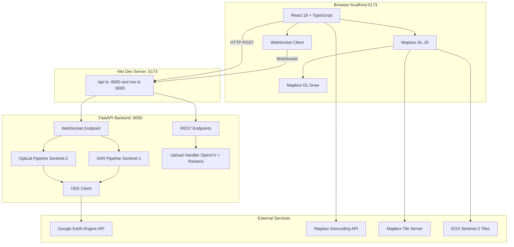
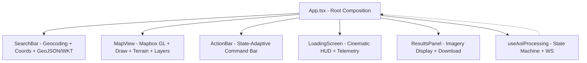
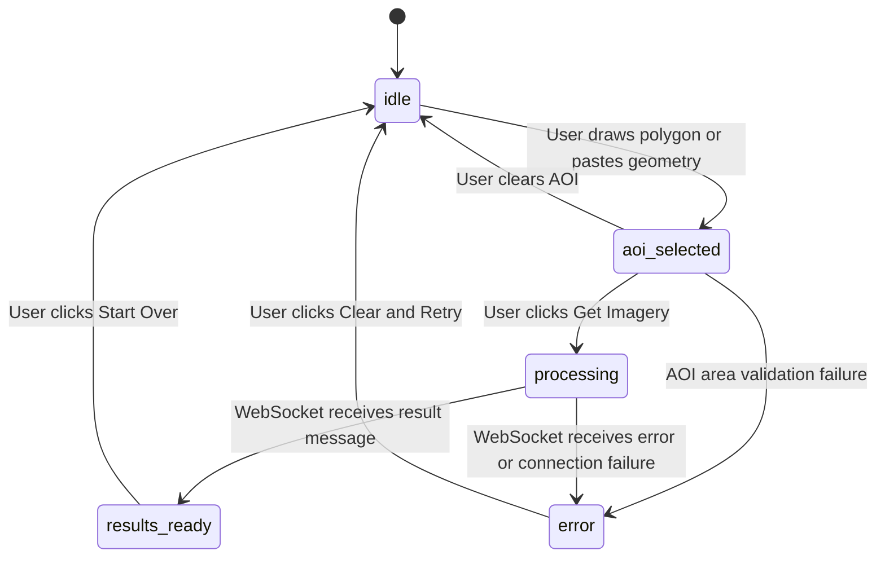

# SatQuery AI — Architecture Document

> **Last Updated:** 2026-09-25
> **Iteration:** v0.1.0 — Initial Architecture Baseline
> **Maintainers:** Update this document after every major iteration so that anyone referring to the project understands the current state.

---

## Table of Contents

1. [Project Overview](#1-project-overview)
2. [High-Level Architecture](#2-high-level-architecture)
3. [Repository Structure](#3-repository-structure)
4. [Backend — FastAPI + Google Earth Engine](#4-backend--fastapi--google-earth-engine)
5. [Frontend — React + TypeScript + Vite](#5-frontend--react--typescript--vite)
6. [Frontend ↔ Backend Integration](#6-frontend--backend-integration)
7. [Environment and Configuration](#7-environment-and-configuration)
8. [Build and Development Toolchain](#8-build-and-development-toolchain)
9. [Launcher Scripts](#9-launcher-scripts)
10. [Key Design Decisions](#10-key-design-decisions)
11. [Known Limitations and Future Work](#11-known-limitations-and-future-work)
12. [Changelog](#12-changelog)

---

## 1. Project Overview

**SatQuery AI** is a full-stack web application for interactive satellite imagery retrieval. Users draw an Area of Interest (AOI) on an interactive map, and the system retrieves **Sentinel-2 optical RGB** and **Sentinel-1 SAR backscatter** imagery from Google Earth Engine (GEE).

### Core User Flow

```
User draws polygon on map
    -> Frontend validates area (1-250 km2)
    -> POST /api/aoi with GeoJSON geometry
    -> Backend returns job_id
    -> Frontend opens WebSocket /ws/process/{job_id}
    -> Backend runs Optical pipeline -> SAR pipeline (chained)
    -> Real-time status messages streamed to frontend
    -> Final result: thumbnail URLs + download URLs
    -> Frontend displays imagery in results panel
```

---

## 2. High-Level Architecture



---

## 3. Repository Structure

```
D:\Satquery\
+-- start.bat                          # One-click launcher (backend + frontend)
+-- auth_gee.bat                       # Earth Engine authentication helper
+-- check.js                           # Puppeteer smoke test script
+-- package.json                       # Root package (puppeteer dependency)
|
+-- set-query-ai\
    +-- README.md                      # Project README with quick start
    +-- ARCHITECTURE.md                # <-- THIS FILE
    |
    +-- backend\
    |   +-- .env                       # Active environment config
    |   +-- .env.example               # Template for new setups
    |   +-- requirements.txt           # Python dependencies (9 packages)
    |   +-- run_backend.bat            # Backend launcher with auto-venv
    |   +-- venv\                      # Python 3.12 virtual environment
    |   +-- secrets\                   # GEE service account key (gitignored)
    |   +-- input_images\              # Uploaded custom images storage
    |   +-- app\
    |       +-- __init__.py            # Package marker
    |       +-- main.py                # FastAPI app, routes, WebSocket handler
    |       +-- config.py              # Pydantic-settings configuration
    |       +-- gee_client.py          # GEE initialization and credential logic
    |       +-- schemas.py             # Pydantic request/response models
    |       +-- pipelines\
    |           +-- __init__.py        # Shared utilities (thumbnail sizing)
    |           +-- optical.py         # Sentinel-2 RGB pipeline
    |           +-- sar.py             # Sentinel-1 SAR pipeline
    |
    +-- frontend\
        +-- .env                       # Mapbox token + API URLs
        +-- .env.example               # Template
        +-- package.json               # Node dependencies
        +-- vite.config.ts             # Vite config with dev proxy
        +-- tailwind.config.js         # Tailwind v3 design tokens
        +-- postcss.config.js          # PostCSS (Tailwind + Autoprefixer)
        +-- tsconfig.json              # TypeScript project references
        +-- index.html                 # HTML shell with polyfills
        +-- src\
            +-- main.tsx               # React 19 entry point
            +-- App.tsx                # Root component (composition)
            +-- index.css              # Design system (704 lines)
            +-- vite-env.d.ts          # Vite type augmentation
            +-- mapbox-gl-draw.d.ts    # MapboxDraw TS declarations
            +-- components\
            |   +-- MapView.tsx        # Mapbox GL map + Draw + terrain + layers
            |   +-- ActionBar.tsx      # Floating command bar (state-adaptive)
            |   +-- SearchBar.tsx      # Geocoding + coord + GeoJSON/WKT input
            |   +-- LoadingScreen.tsx  # Cinematic HUD during processing
            |   +-- ResultsPanel.tsx   # Imagery results display + download
            +-- hooks\
            |   +-- useAoiProcessing.ts # Central state machine + WS lifecycle
            +-- types\
            |   +-- index.ts           # Shared TypeScript interfaces
            +-- utils\
                +-- area.ts            # Geodesic area + GeoJSON/WKT parsing
```

---

## 4. Backend — FastAPI + Google Earth Engine

### 4.1 Technology Stack

| Technology | Version | Purpose |
|---|---|---|
| **Python** | 3.12.10 | Runtime (stable, full C-extension support for geospatial) |
| **FastAPI** | 0.141.x | ASGI web framework (REST + WebSocket) |
| **Uvicorn** | 0.54.x | ASGI server with hot-reload, HTTP/WebSocket support |
| **earthengine-api** | 1.7.x | Google Earth Engine Python client |
| **Pydantic** | 2.13.x | Data validation and serialization |
| **pydantic-settings** | 2.15.x | Typed configuration from env vars / `.env` files |
| **python-dotenv** | 1.2.x | `.env` file loading |
| **OpenCV (cv2)** | 5.0.x | Image format conversion (GeoTIFF to PNG for uploads) |
| **Rasterio** | 1.5.x | Geospatial raster I/O (read GeoTIFF metadata + bands) |
| **python-multipart** | 0.0.32 | Multipart form data parsing for file uploads |

### 4.2 Application Entry and Lifespan

**File:** `backend/app/main.py`

The FastAPI application uses an **async context manager lifespan** to initialize GEE on startup and clear the in-memory job store on shutdown:

```python
@asynccontextmanager
async def lifespan(app: FastAPI):
    initialize_gee()       # Connect to Earth Engine
    yield
    jobs.clear()           # Cleanup ephemeral job store

app = FastAPI(lifespan=lifespan)
```

**CORS** is configured to allow the frontend dev server with origin regex matching any localhost/127.0.0.1 port:

```python
allow_origin_regex=r"^http://(localhost|127\.0\.0\.1)(:\d+)?$"
```

**Static files** are mounted at `/images` to serve uploaded custom images from `input_images/`.

### 4.3 Configuration System

**File:** `backend/app/config.py`

Uses `pydantic-settings.BaseSettings` for typed, validated configuration with environment variable and `.env` file support. A singleton `settings` instance is imported throughout the app.

| Variable | Default | Description |
|---|---|---|
| `GEE_SERVICE_ACCOUNT_KEY_PATH` | `./secrets/gee-service-account.json` | Path to GEE service account JSON key |
| `GEE_SERVICE_ACCOUNT_EMAIL` | `""` | Service account email (auto-read from key if empty) |
| `GEE_PROJECT` | `smart-caster-508412-q2` | Google Cloud Project ID |
| `FRONTEND_ORIGIN` | `http://localhost:5173` | CORS allowed origin |
| `MIN_AOI_AREA_KM2` | `1.0` | Minimum AOI (100x100 pixels at 10m) |
| `MAX_AOI_AREA_KM2` | `250.0` | Maximum AOI (GEE 32 MB limit safety) |

### 4.4 GEE Client Initialization

**File:** `backend/app/gee_client.py`

Implements a **two-tier authentication strategy**:

1. **Service Account (primary):** If a JSON key file exists at `GEE_SERVICE_ACCOUNT_KEY_PATH`, create `ee.ServiceAccountCredentials` and initialize. The project ID and email are auto-extracted from the key file if not explicitly configured.
2. **Local Credentials (fallback):** If no key file is found, fall back to `ee.Initialize()` using the user's local `earthengine authenticate` credentials.

The initialization is guarded by a `_initialized` flag to ensure it runs exactly once. All other modules call `get_ee()` which lazily triggers initialization.

### 4.5 REST API Endpoints

| Method | Path | Request | Response | Description |
|---|---|---|---|---|
| `GET` | `/api/config` | -- | `ConfigResponse` | Returns `max_aoi_area_km2` and `min_aoi_area_km2`. Frontend fetches on mount (DRY). |
| `POST` | `/api/aoi` | `AoiRequest` (GeoJSON + dates) | `AoiResponse` (job_id) | Validates AOI area, stores job params, returns UUID job_id. |
| `POST` | `/api/upload` | `multipart/form-data` | `ResultMessage` | Accepts `.tif/.tiff/.geotiff/.png/.jpg/.jpeg`. GeoTIFFs processed with Rasterio + OpenCV. |

**AOI Area Computation** uses the Shoelace formula on WGS-84 coordinates with latitude correction:

```
area_km2 = area_deg2 x 111.32 km/deg_lat x (111.32 x cos(lat)) km/deg_lon
```

Both client and server implement this formula identically for consistent validation.

### 4.6 WebSocket Endpoint

**Path:** `WS /ws/process/{job_id}`

This is the core processing endpoint. After the frontend POSTs an AOI and receives a `job_id`, it opens a WebSocket to stream real-time status and receive results.

**Message Types (Server to Client):**

| Type | Schema | Purpose |
|---|---|---|
| `status` | `{ type: "status", message: string }` | Progress updates during pipeline execution |
| `result` | `{ type: "result", optical_url, sar_url, ... }` | Final imagery URLs (thumbnails + GeoTIFF downloads) |
| `error` | `{ type: "error", message: string }` | Error notification before connection close |

**Processing Flow:**

1. Look up the job from the in-memory store
2. Initialize GEE client (if not already done)
3. Convert GeoJSON geometry to `ee.Geometry`
4. **Run Optical Pipeline** -- returns thumbnail URL, download URL, and acquisition date
5. **Run SAR Pipeline** (chained to optical's acquisition date +/-7 days) -- returns thumbnail URL, download URL
6. Send `ResultMessage` with all URLs and AOI bounding box
7. Clean up: evict job from store, close WebSocket

**Thread Bridging:** GEE calls are synchronous and blocking. The backend uses `asyncio.run_coroutine_threadsafe()` to bridge synchronous pipeline callbacks (`sync_send_status`) with the async WebSocket `send_json()` method, and `asyncio.to_thread()` via `run_with_backoff()` to run pipelines off the event loop.

### 4.7 Satellite Imagery Pipelines

#### 4.7.1 Optical Pipeline (Sentinel-2)

**File:** `backend/app/pipelines/optical.py`
**Data Source:** `COPERNICUS/S2_SR_HARMONIZED` (Sentinel-2 Level-2A Surface Reflectance)

**Processing Steps:**

1. **Filter** the collection by AOI bounds and date range
2. **Auto-expand** the search window backwards by 90 days if no images found
3. **Progressive cloud filter** -- relaxes `CLOUDY_PIXEL_PERCENTAGE` threshold (20% -> 40% -> 60% -> 80% -> 100%) until at least 3 images are available for a robust median
4. **Limit** to top 10 least-cloudy scenes to prevent GEE timeouts
5. **SCL cloud masking** -- per-pixel rejection using Scene Classification Layer:
   - Class 3: Cloud Shadow
   - Class 8: Cloud Medium Probability
   - Class 9: Cloud High Probability
   - Class 10: Cirrus
   - Intentionally keeps Class 1 (Saturated) and Class 11 (Snow) to avoid false masking on urban structures
6. **Reflectance scaling** from Digital Number to 0-1 (divide by 10000)
7. **Median composite** of B4/B3/B2 -- eliminates transient clouds statistically
8. **Multi-tier void filling:**
   - Primary: 120-day extended clear-sky median composite
   - Secondary: Raw unmasked median (scaled)
9. **RGB visualization** with `min=0.0, max=0.28, gamma=1.3` for dark, high-contrast stretch
10. **Thumbnail** via `getThumbURL` (scale-based for small AOIs, dimension-capped at 2048px for large)
11. **Download URL** via `getDownloadURL` (GeoTIFF, 10m, full resolution)

**Returns:** `{ thumb_url, download_url, acquisition_date_ms, bounds }`

#### 4.7.2 SAR Pipeline (Sentinel-1)

**File:** `backend/app/pipelines/sar.py`
**Data Source:** `COPERNICUS/S1_GRD` (Sentinel-1 Ground Range Detected)

**Processing Steps:**

1. **Temporal chaining** -- computes a +/-7 day window around the optical pipeline's acquisition date
2. **Filter** by AOI, date window, IW instrument mode, and VV+VH dual polarisation
3. **Median composite** -- temporal median across all acquisitions in the window (natural speckle reduction without spatial blurring)
4. **VV band selection** -- provides sharpest urban detail via double-bounce returns
5. **Visualization** with `min=-20 dB, max=2 dB`, nodata filled with `-30 dB` (rendered black)
6. **Thumbnail + Download URL** generation (same strategy as optical)

**Returns:** `{ thumb_url, download_url }`

#### 4.7.3 Shared: Thumbnail Parameter Computation

**File:** `backend/app/pipelines/__init__.py`

The `compute_thumb_params()` function determines the optimal GEE thumbnail rendering strategy:
- **Small/medium AOIs:** `{ scale: 10 }` -- native Sentinel pixel resolution, maximum sharpness
- **Large AOIs (>2048px):** `{ dimensions: 2048 }` -- caps to prevent GEE errors

### 4.8 Custom Image Upload

**Endpoint:** `POST /api/upload`

Accepts raster image files, processes GeoTIFFs using Rasterio and OpenCV:

1. **Read** using `rasterio.open()` to extract band data and geographic bounds
2. **Normalize** using 2nd-98th percentile stretch to 0-255 uint8
3. **Convert** RGB to BGR for OpenCV, write PNG thumbnail
4. **Return** a `ResultMessage` with the served image URL and AOI bounds

### 4.9 Error Handling and Resilience

- **Exponential backoff:** `run_with_backoff()` retries GEE calls up to 3 times with `2^attempt` second delays
- **Graceful partial failure:** If one pipeline (optical or SAR) fails, the other's results are still returned. Only if both fail does the WebSocket send an error.
- **GEE startup failure:** The app still starts; processing requests will fail but the config endpoint remains available
- **Job cleanup:** `jobs.pop()` in a `finally` block prevents memory leaks

### 4.10 Pydantic Schemas

**File:** `backend/app/schemas.py`

| Schema | Usage |
|---|---|
| `AoiRequest` | POST body -- GeoJSON geometry + optional `date_start`/`date_end` (defaults: 60 days ago to today) |
| `AoiResponse` | POST response -- `job_id` (UUID) |
| `ConfigResponse` | GET response -- `max_aoi_area_km2`, `min_aoi_area_km2` |
| `StatusMessage` | WS message -- progress text |
| `ResultMessage` | WS message -- thumbnail URLs, download URLs, per-pipeline errors, AOI bounds |
| `ErrorMessage` | WS message -- error text |

All schemas use Pydantic v2 with `field_validator` for GeoJSON geometry type checking.

---

## 5. Frontend — React + TypeScript + Vite

### 5.1 Technology Stack

| Technology | Version | Purpose |
|---|---|---|
| **React** | 19.2.x | UI framework |
| **TypeScript** | ~6.0 | Type safety |
| **Vite** | 8.3.x | Build tool + dev server with HMR |
| **Tailwind CSS** | 3.4.x | Utility-first CSS framework |
| **PostCSS** | 8.5.x | CSS processing (Tailwind + Autoprefixer) |
| **Mapbox GL JS** | 3.30.x | WebGL map rendering |
| **react-map-gl** | 8.1.x | React bindings for Mapbox GL |
| **@mapbox/mapbox-gl-draw** | 1.5.x | Polygon drawing tools |
| **Lucide React** | 1.45.x | Icon library |
| **OxLint** | 1.81.x | Fast linter (Rust-based) |

### 5.2 Component Architecture



#### Component Details

| Component | File | Responsibility |
|---|---|---|
| **App** | `App.tsx` | Root composition. Connects the `useAoiProcessing` hook to all child components. Manages `mapRef` for programmatic map control. |
| **MapView** | `MapView.tsx` | Full-viewport Mapbox GL map with: satellite streets basemap, Mapbox Draw polygon tool (custom emerald-themed styles), 3D terrain toggle (DEM exaggeration 1.5x), Sentinel-2 global mosaic layer toggle (EOX tiles), vignette overlay, navigation controls. Syncs AOI from props to draw tool bidirectionally. |
| **ActionBar** | `ActionBar.tsx` | Fixed bottom floating bar. Adapts layout per `appState`: idle (instructions + upload), aoi_selected (area badge + date pickers + submit), processing (spinner), results_ready (start over), error (message + retry). |
| **SearchBar** | `SearchBar.tsx` | Multi-mode search: place name geocoding (Mapbox API, debounced 400ms), coordinate input (`lat, lng` regex), GeoJSON/WKT polygon paste (parsed + area validated). Shows validation feedback inline. |
| **LoadingScreen** | `LoadingScreen.tsx` | Cinematic overlay during processing: orbital ring animation, asymptotic progress bar, scan-line telemetry terminal with staggered log entries and typewriter cursor. |
| **ResultsPanel** | `ResultsPanel.tsx` | Results overlay: optical + SAR imagery cards with metadata ribbons, download buttons (GeoTIFF), close button with hover rotation. Handles graceful per-pipeline error display. |

### 5.3 State Machine

**File:** `hooks/useAoiProcessing.ts`

The application has a single, linear state machine with 5 states:



**State Shape (`ProcessingState`):**

```typescript
interface ProcessingState {
  appState: "idle" | "aoi_selected" | "processing" | "results_ready" | "error";
  aoiGeometry: AoiGeometry | null;
  aoiAreaKm2: number | null;
  statusMessages: string[];
  result: ResultPayload | null;
  errorMessage: string | null;
  maxAoiAreaKm2: number;    // from server config
  minAoiAreaKm2: number;    // from server config
  dateStart: string | null;
  dateEnd: string | null;
}
```

### 5.4 Data Flow and WebSocket Lifecycle

```
1. Mount -> fetch GET /api/config -> store max/min AOI area
2. User draws AOI -> setAoi() validates area client-side
3. User clicks "Get Imagery" -> submitAoi():
   a. POST /api/aoi { geometry, date_start, date_end }
   b. Receive { job_id }
   c. Open WebSocket: ws://localhost:8000/ws/process/{job_id}
   d. On "status" messages -> append to statusMessages[]
   e. On "result" message -> transition to results_ready
   f. On "error" message -> transition to error
   g. On connection close -> cleanup wsRef
4. User clicks "Start Over" -> reset() closes WS, clears state
```

### 5.5 Map Integration

**Basemap:** `mapbox://styles/mapbox/satellite-streets-v12` (initial view centered on India: 78.96 E, 20.59 N, zoom 4)

**Draw Tool Configuration:**
- Controls: polygon + trash only (no line, point, or rectangle)
- Default mode: `simple_select`
- Custom styles: emerald fill (10% opacity), dashed emerald stroke, glow vertex dots, cyan line preview
- Events: `draw.create`, `draw.update`, `draw.delete` -> call `onAoiChange(geometry)`

**Additional Layers:**
- **3D Terrain:** Mapbox DEM (`mapbox-terrain-dem-v1`), 1.5x exaggeration, pitch 60 degrees, bearing 15 degrees
- **Sentinel-2 Global Mosaic:** EOX S2 cloudless 2020 WMTS tiles overlaid below symbol layers

**Vite Dev Proxy** (transparent to the frontend):
```typescript
proxy: {
  '/api': { target: 'http://localhost:8000', changeOrigin: true },
  '/ws':  { target: 'ws://localhost:8000', ws: true },
}
```

### 5.6 Search System

The `SearchBar` component accepts three input types:

1. **Place name** -> Mapbox Geocoding API v5 (`mapbox.places`), 400ms debounce, geocoding results displayed in a staggered dropdown
2. **Coordinates** -> regex match for `lat, lng` format, directly flies to the point at zoom 14
3. **GeoJSON / WKT** -> parsed by `utils/area.ts` (`parseInputGeometry`), supports Feature, FeatureCollection, Polygon, MultiPolygon, and `POLYGON((...))` WKT. Area is validated against limits with inline feedback badge.

### 5.7 Design System and Styling

The visual design uses a **dark, satellite-operations-inspired aesthetic** combining Tailwind CSS utilities with a custom CSS component layer.

#### Color Palette

| Token | Hex | Usage |
|---|---|---|
| `surface-0` | `#060A13` | Deepest background |
| `surface-1` | `#0B101E` | Primary surface |
| `surface-2` | `#111827` | Elevated surface |
| `surface-3` | `#1A2332` | Cards / raised panels |
| `accent-emerald` | `#10B981` | Primary accent (AOI, success) |
| `accent-cyan` | `#06B6D4` | Secondary accent (lines, links) |
| `accent-teal` | `#14B8A6` | Tertiary accent |

#### Typography

- **UI:** Inter (weights 300-800)
- **Data/Telemetry:** JetBrains Mono (weights 400-700)
- Loaded via Google Fonts with `preconnect`

#### Glassmorphism System

The `glass-panel` class implements multi-layer glassmorphism:
- `backdrop-filter: blur(20px) saturate(1.5)`
- Semi-transparent background with emerald-tinted borders
- Multi-layer box shadows (depth + inner highlights)
- Noise texture overlay via inline SVG `feTurbulence` filter
- Hover state with intensified glow

#### Animations (defined in `tailwind.config.js`)

| Animation | Duration | Usage |
|---|---|---|
| `fade-in` | 0.4s | Component entrance |
| `slide-up/down` | 0.5s | Panel entrance/exit |
| `glow-pulse` | 3s infinite | Active element glow |
| `shimmer` | 2.5s infinite | Button shine effect |
| `orbit` | 8-20s infinite | Loading orbital rings |
| `typewriter-blink` | 1s infinite | Terminal cursor |
| `pulse-ring` | 2s infinite | Status indicators |

All animations use `cubic-bezier(0.16, 1, 0.3, 1)` (spring easing) for organic motion.

#### Custom CSS Components (index.css, 704 lines)

Major component classes beyond Tailwind utilities:

| Class | Purpose |
|---|---|
| `.glass-panel` | Primary glassmorphism container |
| `.glass-card` | Elevated card within panels |
| `.brand-header` | Fixed top header bar |
| `.action-bar` | Bottom floating command bar |
| `.loading-screen` | Full-viewport cinematic overlay |
| `.orbital-container/ring/dot/core` | Loading animation elements |
| `.telemetry-terminal` | Log display terminal |
| `.progress-bar-track/fill` | Gradient progress indicator |
| `.results-panel` | Results overlay backdrop |
| `.result-card` | Individual imagery card |
| `.map-tool-btn` | Map overlay control buttons |
| `.btn-primary/secondary` | Action buttons |
| `.input-dark` | Dark-themed form inputs |
| `.search-input-wrapper` | Search with animated glow |
| `.map-vignette` | Map edge darkening overlay |
| `.badge-area` | AOI area display badge |
| `.noise-texture` | SVG noise overlay mixin |

---

## 6. Frontend ↔ Backend Integration

| Protocol | Flow | Details |
|---|---|---|
| **HTTP GET** | Frontend -> Backend | `GET /api/config` on mount for DRY AOI limits |
| **HTTP POST** | Frontend -> Backend | `POST /api/aoi` with GeoJSON geometry + dates |
| **HTTP POST** | Frontend -> Backend | `POST /api/upload` with multipart form data |
| **WebSocket** | Bidirectional | `WS /ws/process/{job_id}` -- server pushes status/result/error JSON |
| **Static Files** | Frontend <- Backend | `GET /images/{filename}` for uploaded custom images |

**API Base URLs** (configurable via `.env`):
- HTTP: `VITE_API_BASE_URL` -> `http://localhost:8000`
- WebSocket: `VITE_WS_BASE_URL` -> `ws://localhost:8000`

**Dev Proxy:** In development, Vite proxies `/api/*` and `/ws/*` requests to `localhost:8000`, so the frontend can also use relative URLs.

---

## 7. Environment and Configuration

### Backend `.env`

```env
GEE_SERVICE_ACCOUNT_KEY_PATH=./secrets/gee-service-account.json
GEE_SERVICE_ACCOUNT_EMAIL=gee-536@smart-caster-508412-q2.iam.gserviceaccount.com
FRONTEND_ORIGIN=http://localhost:5173
MAX_AOI_AREA_KM2=250
```

### Frontend `.env`

```env
VITE_MAPBOX_TOKEN=pk.eyJ1...                  # Mapbox access token
VITE_API_BASE_URL=http://localhost:8000        # Backend API URL
VITE_WS_BASE_URL=ws://localhost:8000           # Backend WebSocket URL
```

### External Service Dependencies

| Service | Purpose | Auth |
|---|---|---|
| **Google Earth Engine** | Satellite imagery processing | Service account JSON key or local `earthengine authenticate` |
| **Mapbox** | Map tiles + geocoding API | Access token in `VITE_MAPBOX_TOKEN` |
| **EOX S2 Maps** | Sentinel-2 cloudless global mosaic tiles | None (public WMTS) |
| **Google Fonts** | Inter + JetBrains Mono | None (public CDN) |

---

## 8. Build and Development Toolchain

### Backend

```bash
cd set-query-ai/backend
python -m venv venv                    # Python 3.12
venv\Scripts\activate
pip install -r requirements.txt        # 9 direct dependencies
uvicorn app.main:app --reload --port 8000
```

### Frontend

```bash
cd set-query-ai/frontend
npm install                            # Install from package-lock.json
npm run dev                            # Vite dev server on :5173
npm run build                          # TypeScript compile + Vite production build
npm run lint                           # OxLint (Rust-based, fast)
npm run preview                        # Preview production build
```

### Root-Level Puppeteer Test

```bash
cd D:\Satquery
npm install                            # Installs puppeteer
node check.js                          # Headless browser smoke test on :5173
```

---

## 9. Launcher Scripts

| Script | Location | Purpose |
|---|---|---|
| `start.bat` | `D:\Satquery\` | **One-click launcher.** Launches backend + frontend in separate CMD windows, waits 5 seconds, opens `http://localhost:5173` in browser. |
| `run_backend.bat` | `set-query-ai/backend/` | Activates venv (creates if missing), installs requirements, runs `uvicorn` on port 8000. |
| `run_frontend.bat` | `set-query-ai/frontend/` | Runs `npm run dev` (Vite on port 5173). |
| `auth_gee.bat` | `D:\Satquery\` | Activates backend venv, runs `ee.Authenticate()` to link Google account for Earth Engine access. |

---

## 10. Key Design Decisions

| Decision | Rationale |
|---|---|
| **Temporal chaining (Optical then SAR)** | SAR is filtered to +/-7 days of the optical acquisition date to ensure cross-modal temporal coherence for meaningful comparison. |
| **Progressive cloud filter** | Strict cloud thresholds first (20%), relaxed only when insufficient images survive. Guarantees best quality while maximizing coverage. |
| **Median composite (not mosaic)** | Temporal median statistically eliminates transient cloud/shadow contamination far more effectively than `mosaic()` which takes the first available pixel. |
| **SCL masking over QA60** | QA60 has coarse 60m resolution causing blocky artifacts and false positives over urban structures. SCL at 20m is the authoritative L2A classification. |
| **Keep SCL class 1 (Saturated)** | In urban environments, bright reflective surfaces (metal roofs, solar panels) are falsely classified as saturated. Masking creates black holes. |
| **VV-only SAR visualization** | VV provides sharpest urban detail via double-bounce. VV+VH averaging adds noise without improving structural detail. |
| **GEE 32 MB safety cap** | All exports are 3-band uint8. Max AOI capped at 250 km2 to stay under `getDownloadURL`'s 32 MB limit at 10m resolution. |
| **DRY config via `/api/config`** | Frontend fetches `max_aoi_area_km2` from the server on mount -- no hardcoded limits in client code. Single source of truth. |
| **WebSocket for processing** | Enables real-time status streaming during the 10-60 second GEE processing window, replacing polling. |
| **In-memory job store** | Prototype-only `dict` for simplicity. Evicted in `finally` block. Must migrate to Redis/PostgreSQL for production multi-worker deployments. |
| **Python 3.12 (not 3.14)** | Selected for stable binary wheel availability for C-extension dependencies (`rasterio`, `opencv-python`, `numpy`). Python 3.14 is pre-release and lacks wheel support. |

---

## 11. Known Limitations and Future Work

| Area | Limitation | Future Direction |
|---|---|---|
| **Job Store** | Ephemeral in-memory dict -- lost on restart, single-worker only | Migrate to Redis or PostgreSQL |
| **GEE Auth** | Service account key must be manually placed in `secrets/` | Integrate with GCP Secret Manager or Workload Identity |
| **GEE Errors** | Some GEE `getInfo()` calls are synchronous and can timeout | Implement task-based GEE exports with polling |
| **AOI Types** | Only Polygon and MultiPolygon supported | Add support for bounding box, circle, and point+radius |
| **Multi-User** | No authentication or user isolation | Add auth layer (OAuth2 / JWT) |
| **Image Cache** | No caching -- same AOI re-queries GEE every time | Add result caching with TTL |
| **Deployment** | Local development only (localhost) | Dockerize, deploy to Cloud Run / ECS |
| **Testing** | Only manual Puppeteer smoke test | Add pytest for backend, Vitest for frontend |

---

## 12. Changelog

### v0.1.0 — Initial Architecture Baseline (2026-09-25)

- **Backend:** FastAPI with Google Earth Engine integration
  - Sentinel-2 optical pipeline with progressive cloud filtering, SCL masking, median composite, multi-tier void fill
  - Sentinel-1 SAR pipeline temporally chained to optical (+/-7 day window)
  - WebSocket real-time status streaming
  - Custom image upload with GeoTIFF processing (Rasterio + OpenCV)
  - Pydantic v2 schemas, pydantic-settings configuration
  - Exponential backoff for GEE resilience
- **Frontend:** React 19 + TypeScript + Vite 8
  - Mapbox GL JS map with Draw polygon tool, 3D terrain, Sentinel-2 mosaic layer
  - Multi-mode SearchBar (geocoding, coordinates, GeoJSON/WKT paste)
  - Cinematic LoadingScreen with orbital animations and telemetry terminal
  - ResultsPanel with Sentinel-2 + Sentinel-1 imagery display and GeoTIFF download
  - State-adaptive ActionBar with date range selection
  - Custom glassmorphism design system (dark satellite-ops theme)
- **Environment:** Python 3.12.10 virtual environment, Node.js 18+ with all dependencies installed
- **Launchers:** `start.bat` one-click launcher for both servers
